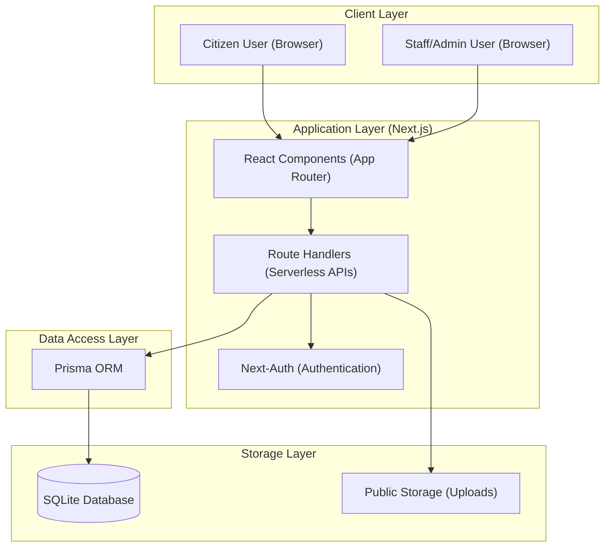
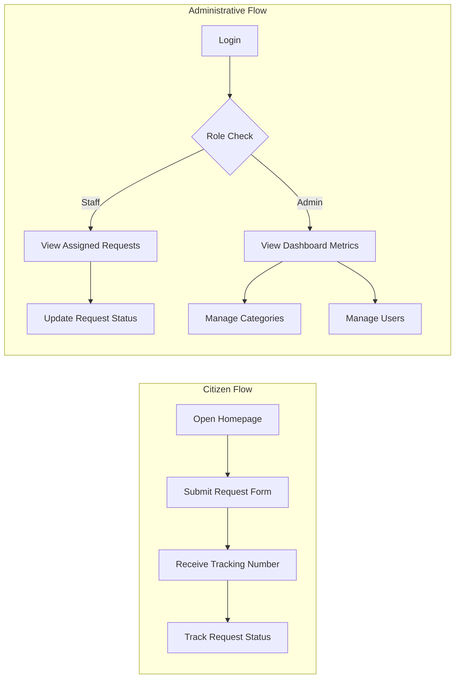
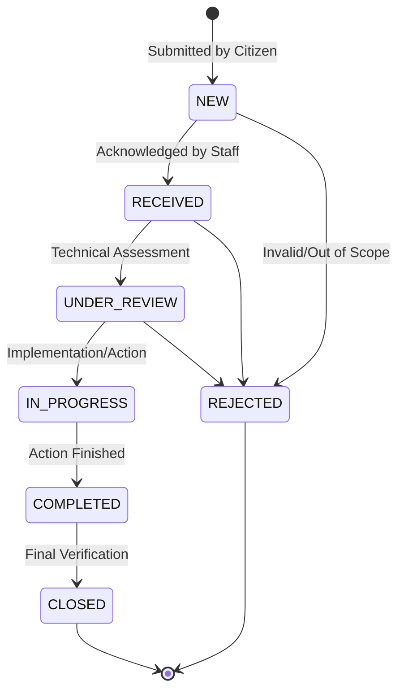
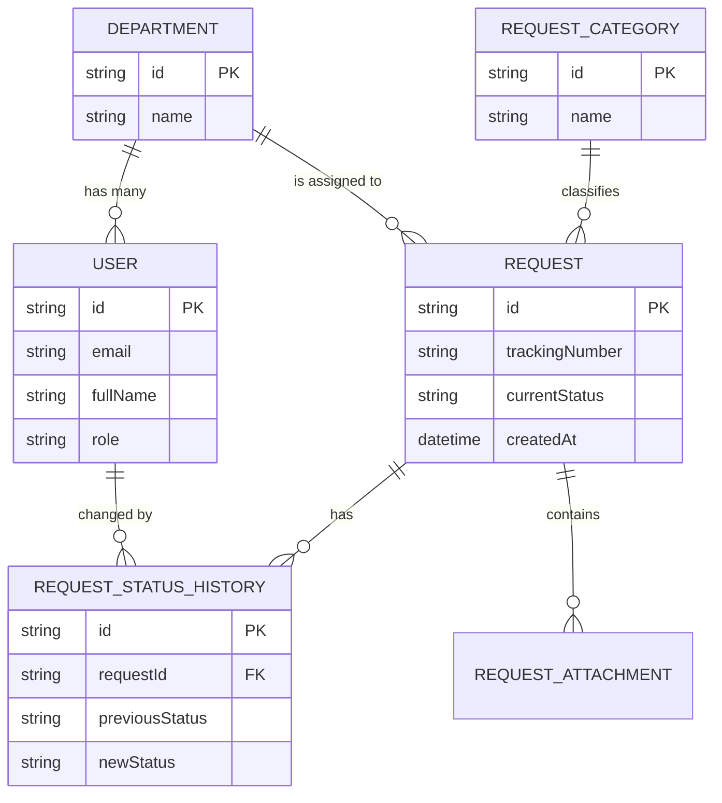

# System Architecture & Diagrams

## 1. Overall System Architecture
The research prototype follows a modern monolithic architecture using the Next.js App Router, which consolidates both the frontend user interface and the backend API logic into a single deployment unit.

## 2. User Flow Diagram
This diagram illustrates the primary workflows for the three distinct user roles in the system.

## 3. Request Lifecycle Diagram
The request lifecycle follows a linear progression for service delivery, with an optional terminal state for rejected cases.

## 4. Database ER Overview (Simplified)
The data model is designed to maintain relational integrity while preserving a clear history of all status changes.

## 5. Technology Stack Summary

| Layer | Technology | Description |
|-------|------------|-------------|
| **Frontend** | Next.js (React) | High-performance React framework for UI development. |
| **Backend** | Next.js Route Handlers | Server-side logic and API implementation. |
| **ORM** | Prisma | Type-safe data access and schema management. |
| **Database** | SQLite | Lightweight, file-based relational database. |
| **Styling** | Tailwind CSS | Utility-first CSS framework for polished aesthetics. |
| **Icons** | Lucide React | Modern, clean iconography. |
| **Testing** | Playwright | End-to-end browser automation and validation. |
| **Language** | TypeScript | Strong typing for system reliability and maintainability. |

## 6. Implementation Notes
- **Determinism**: All diagrams reflect the actual implemented logic found in the `src/app` and `prisma/schema.prisma` files.
- **Scalability**: While using SQLite for the research prototype, the architecture is designed to easily migrate to PostgreSQL for enterprise production.
- **Validation**: Statuses in the Lifecycle Diagram match the `RequestStatus` enum defined in the system core.
