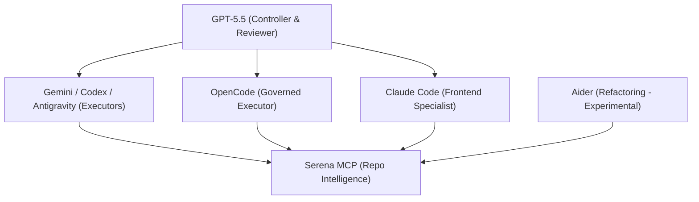

# AI Organizational Architecture

This document describes the role, capabilities, and operational guidelines for each model and runtime inside the AI Tools Kit organization.

## Org Map

## Runtime & Model Matrix

### 1. GPT-5.5
- **Role:** Controller, Reviewer, final gatekeeper.
- **Capabilities:** High-reasoning architecture analysis, governance reviews, structural audits, and approval validation.
- **Usage Guidelines:** Position at the start (planning/verification) and end (review gate) of task lifecycles.

### 2. Gemini
- **Role:** High-context general Executor.
- **Capabilities:** Code generation, test scaffolding, API wrapping, and dashboard plumbing.
- **Usage Guidelines:** Used for execution loops needing broad codebase context without complex UI automation requirements.

### 3. Claude
- **Role:** Frontend Specialist.
- **Capabilities:** React, Next.js, CSS grid layouts, and advanced UI state animations.
- **Usage Guidelines:** Route visual dashboard enhancements, component restructuring, and operator console UI tasks.

### 4. Serena
- **Role:** Repository Intelligence provider.
- **Capabilities:** 29 specialized tools for symbol search, reference parsing, file structure mapping, and diagnostics.
- **Usage Guidelines:** Act as the primary semantic indexing layer. All agents use Serena to gather context rather than loading large files from memory.

### 5. Aider
- **Role:** Refactoring agent (experimental).
- **Capabilities:** Interactive multi-file modifications and automated test-driven loop adjustments.
- **Usage Guidelines:** Restricted to sandbox branches for code restructuring.

### 6. Codex
- **Role:** Coding-specific execution worker.
- **Capabilities:** Clean, targeted modifications, and localized test fixes.
- **Usage Guidelines:** Invoked for routine code-level changes, dependency fixes, and baseline scripting.

### 7. OpenCode
- **Role:** Governed Controller Support.
- **Capabilities:** Explicit permission gate parsing, instruction execution, and bounded shell task runs.
- **Usage Guidelines:** Ideal for orchestrating validation commands in highly restricted security environments.

### 8. Antigravity
- **Role:** Premium Agentic Desktop Runtime.
- **Capabilities:** Browser control (DOM reading, page actions), local system control, and Serena MCP integration.
- **Usage Guidelines:** Route complex agentic executions requiring browser interaction or multi-faceted workspace inspections.
